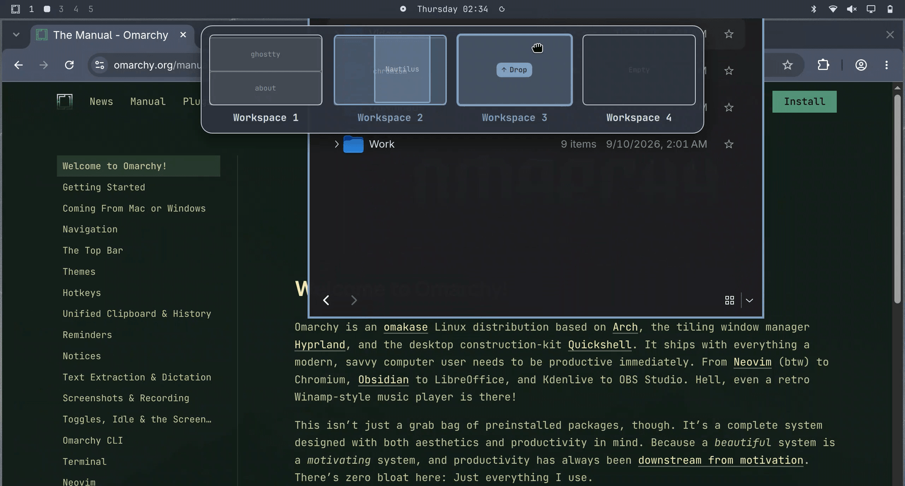

# DropSpace

Visual workspace drag-and-drop overlay for Omarchy.

Drag a window onto a target workspace card at the top of the screen and release it to move the window and switch workspace focus seamlessly.




---

## Install

### 1. Add the Plugin to Omarchy

```sh
omarchy plugin add https://github.com/harryxu/omarchy-dropspace.git --enable
```

### 2. Add Hyprland Keybindings

Add the following bindings to `~/.config/hypr/bindings.lua`:

```lua
local dropspace_handler = (os.getenv("HOME") or "") .. "/.config/omarchy/plugins/dropspace/bin/drop-handler.sh"
o.bind("SUPER + d", "DropSpace: Toggle workspace targets", "omarchy-shell shell toggle harryxu.dropspace '{}'")
o.bind("SUPER + mouse:272", "DropSpace: Drop window to workspace", dropspace_handler, { mouse = true, release = true })
```

Reload Hyprland to apply:

```sh
hyprctl reload
```

**That's it!** DropSpace is now ready to [use](#usage) with `SUPER + D`.

---

### Optional Setup

#### Enable Top Edge Push Trigger
If you want the workspace bar to automatically slide down when dragging a window toward the top edge, add this to `~/.config/hypr/autostart.lua`:

```lua
local dropspace_autostart = (os.getenv("HOME") or "") .. "/.config/omarchy/plugins/dropspace/bin/dropspace-autostart.sh"
hl.exec_cmd(dropspace_autostart)
```

Then run `hyprctl reload` to launch it immediately.

#### CLI Command Symlink
If you want to use the `dropspace` CLI utility directly from anywhere in your terminal (to check status, view configuration, or uninstall), run the setup helper to create the `~/.local/bin/dropspace` symlink:

```sh
~/.config/omarchy/plugins/dropspace/bin/dropspace setup
```

---

## Usage

### Default Mode (Zero Background Daemons)

1. Press `SUPER + D` to toggle the workspace bar at the top of the screen.
2. Drag any window using `SUPER + Left Click` onto a target workspace card (e.g., Workspace 2).
3. **Release mouse button**: the window moves to that workspace, focus switches, and the workspace bar automatically closes.
4. Press `Escape` or press `SUPER + D` again to dismiss without dropping.

### Optional: Top Edge Push Trigger

If you added the optional autostart line to `~/.config/hypr/autostart.lua` during installation, top-edge triggering is automatically enabled:

1. Drag any window with `SUPER + Left Click` toward the top center of the screen; the workspace bar automatically slides down.
2. Hover over the desired workspace card and release the mouse button.
3. If you change your mind, simply pull the window back down below the cancel threshold to auto-dismiss.

*(To disable top-edge triggering, simply remove or comment out the autostart line in `~/.config/hypr/autostart.lua` and reload Hyprland).*

---

## Configure

Configuration file location: `~/.config/omarchy/dropspace.json`

```json
{
  "top_edge_threshold": 12,
  "cancel_threshold": 180
}
```

- `top_edge_threshold`: Distance from the top screen edge to summon the panel (pixels, default: `12`).
- `cancel_threshold`: Downward distance from the top edge to auto-dismiss when pulling away (pixels, default: `180`).

---

## Remove

To safely and completely remove DropSpace without leaving dangling processes or broken bindings:

### 1. Run the Uninstall Helper

Stops running daemons, removes temporary files, and unlinks `~/.local/bin/dropspace`:

```sh
dropspace uninstall
# (Or: ~/.config/omarchy/plugins/dropspace/bin/dropspace uninstall)
```

*(Optional: pass `--purge` to delete `~/.config/omarchy/dropspace.json` as well).*

### 2. Remove the Plugin from Omarchy

```sh
omarchy plugin remove dropspace
```

### 3. Clean up Hyprland Configuration

Remove or comment out the DropSpace lines from `~/.config/hypr/bindings.lua` (and `~/.config/hypr/autostart.lua` if added), then reload:

```sh
hyprctl reload
```

---

## Dependencies & Permissions

- **Runtime Dependencies**: `python3`, `hyprland`, `omarchy-shell` (Quickshell).
- **Permissions**: Runs entirely within standard user permissions. Never requires `sudo`.
- **Background Processes**: By default, **zero persistent background daemons** are used. The cursor tracker runs only while the overlay is actively open and terminates automatically when closed.

## License

[MIT](LICENSE)